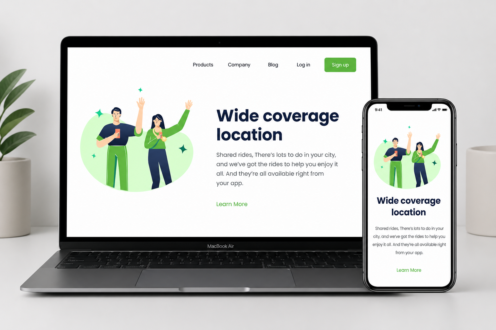
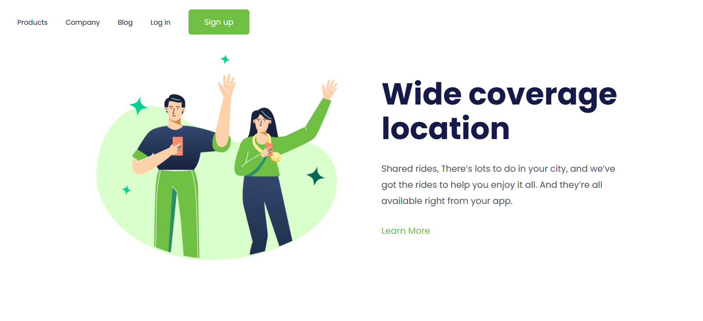
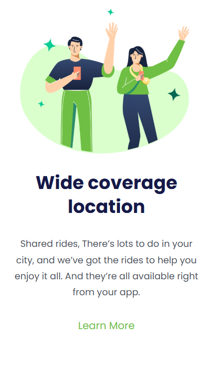

# 🚀 Wide-coverage

Projeto desenvolvido com foco em praticar conceitos de **HTML5** e **CSS3**, criando uma landing page moderna e responsiva.

## 🖼️ Preview do Projeto



---

## 📌 Sobre o Projeto

A página apresenta uma interface limpa e intuitiva com:

- Menu de navegação no topo;
- Imagem ilustrativa principal;
- Título de destaque;
- Descrição objetiva;
- Botão de chamada para ação (**Call To Action**);
- Layout responsivo para diferentes dispositivos.

---

## 🛠️ Tecnologias utilizadas

- HTML5
- CSS3
- Google Fonts

---

## 📱 Responsividade

### 💻 Desktop


### 📲 Mobile


---

## 🎯 Funcionalidades

✔ Navegação no cabeçalho  
✔ Layout moderno e minimalista  
✔ Design responsivo  
✔ Compatível com dispositivos móveis  

---

## 📂 Estrutura de Pastas

```bash
📦 develop-branch
 ┣ 📂 assets
 ┃ ┣ 📜 resposividade.png
 ┃ ┣ 📜 desktop.png
 ┃ ┣ 📜 mobile.png
 ┃ ┗ 📜 Positive.png
 ┣ 📜 index.html
 ┣ 📜 styles.css
 ┗ 📜 README.md
```

---

## 👨‍💻 Autor

Feito por **Ícaro Martins** 🚀

<p align="left">
  <a href="https://linkedin.com/in/icaro-martins87" text-decoration: none>
    
  </a>
  <a href="mailto:seu_icaro.ramon@gmail.com">
    
  </a>
</p>
